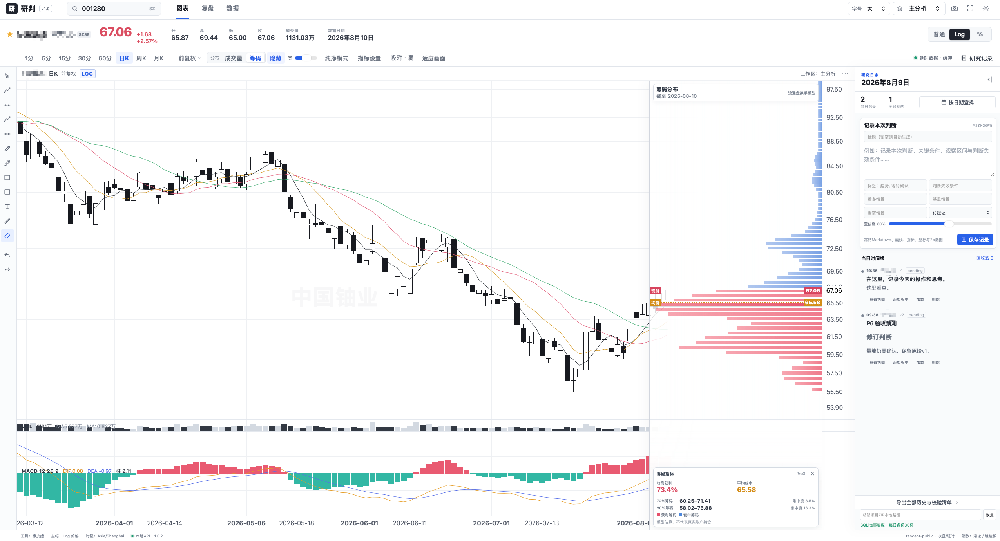
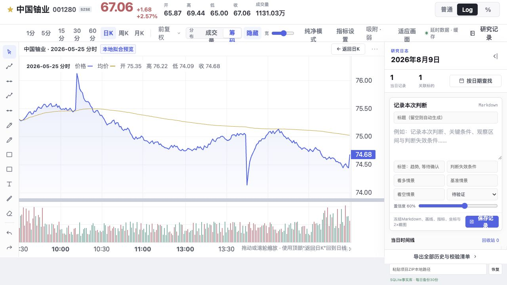

# 研判 · Stock Analysis Dashboard

面向中国 A 股与港股的本地优先技术分析与复盘工作台。它把 TradingView 式的宽阔画布、灵活画线和时间轴操作，与按日期追溯的研究日志放在同一个界面中，适合收盘后的个人复盘与预测。

> 当前版本：`v1.0.2`　·　技术栈：React + TypeScript + Lightweight Charts + FastAPI + SQLite　·　许可证：[MIT](./LICENSE)

## 产品截图

### 日 K、筹码分布与研究日志



### 单日分时复盘



## 产品功能

### 行情与技术指标

- 识别 A 股、北交所与港股代码，支持 `1/5/15/30/60` 分钟、日 K、周 K 和月 K；
- A 股默认前复权，可切换不复权、前复权和后复权；
- 价格轴支持普通、Log 和百分比模式，时间轴可缩放、平移并保留未来画线空间；
- 内置 MA、EMA、VOL 与 MACD，可编辑指标参数或切换纯净模式；
- 点击日 K 后通过操作菜单进入对应交易日的 5 分钟分时图，随时返回原日线视角。

### 专业画线工作台

- 水平线、趋势线、射线、平行通道、矩形、文字、自由画笔和荧光笔；
- 支持 OHLC 吸附、端点拖动、数值滚轮微调、撤销/重做与橡皮擦；
- 图形以日期和价格保存，切换普通/Log 轴或 K 线周期后仍保持相同金融语义；
- “完成画线”前可持续微调，完成后锁定，兼顾精确编辑和避免误触；
- 命名工作区会保存画线、指标、坐标模式和画布状态。

### 成交量分布与筹码分布

两种分布共用右侧区域并互斥显示，避免把“区间成交”与“持仓成本估算”混为一谈。

- **成交量分布**：按当前可视区或锚定区间统计价格档成交量，展示 POC、VAH 和 VAL；
- **筹码分布**：以所选交易日为基准，按换手递推估算存量筹码成本，展示平均成本、收盘获利比例、70%/90% 筹码区间及集中度；
- 滚轮缩放和横向平移只改变画布，不会偷偷改变筹码基准日；
- 指标卡可拖动、折叠或关闭，避免遮挡筹码峰。

### 可追溯研究日志

- 使用 Markdown 记录判断、条件、观察区间与失效标准；
- 同一天可保存多条记录，每次修订都追加版本，不覆盖历史；
- 通过日历检索目标日期，加载当时的图形、指标、坐标与数据截止时间；
- 支持版本对比、回收站、PNG/Markdown/JSON 单条导出，以及带 SHA-256 校验的项目 ZIP 导入导出；
- 记录、截图和行情缓存保存在本机 SQLite 与 `data/` 目录中，并保留每日备份。

## 产品亮点

1. **画线优先的大画布**：导航与信息密度克制，把主要空间还给 K 线和分析图形。
2. **普通/Log 双坐标**：适配短周期价格观察和跨周期趋势分析，大字号坐标与标签保持清晰。
3. **坐标可复现**：画线绑定金融坐标，而不是屏幕像素；缩放、平移和切换周期不会改变原始判断。
4. **历史预测可追溯**：今天写下的判断、画线和快照可以在未来按日期重新打开并核对。
5. **分布概念清晰**：成交量分布随统计区间变化；筹码分布固定基准日并持续标明估算属性。
6. **本地优先、易迁移**：没有账户系统，个人研究数据默认只留在本机，并可完整备份恢复。

## 数据来源与模型边界

- 默认行情 Provider 使用腾讯公开行情接口，提供免费收盘或延时数据，并通过本地缓存降低重复请求；
- 行情服务暂不可用时，界面会明确显示“样例降级”或读取失败，不会把样例数据标记为真实行情；
- Volume Profile 的买卖方向拆分，以及 A 股筹码成本、获利比例和集中度，均是基于公开 OHLCV、成交额、换手率/流通股本的可解释模型估算；
- 本项目适合技术分析、研究记录与收盘复盘，不应作为实时交易或下单数据源。

## 本地部署

### 环境要求

- macOS 或 Linux；
- Node.js 20+；
- Python 3.11+；
- 首次安装依赖及读取在线行情时需要网络。

### 启动

```bash
git clone https://github.com/xie96808/stock-analysis-dashboard.git
cd stock-analysis-dashboard
npm install
npm run app
```

`npm run app` 会自动创建 Python 虚拟环境、安装后端依赖，并启动：

- 看板：<http://127.0.0.1:4173/>
- 本地 API：<http://127.0.0.1:8000/>
- API 文档：<http://127.0.0.1:8000/docs>

重复执行时会复用已经运行的服务；如果端口被其他程序占用，启动脚本会指出对应端口。

### 检查与构建

```bash
# TypeScript、前后端测试、生产构建和 diff 检查
npm run check

# 单独生成生产构建
npm run build

# 生成并校验源码发布包
npm run release:bundle
```

### 本地数据与迁移

运行后产生的 SQLite 数据库、行情缓存、截图、导出文件和每日备份位于 `data/`，并已被 `.gitignore` 排除。迁移到另一台电脑时，优先使用看板内的“导出全部历史与校验清单”生成项目 ZIP，再在目标环境中恢复。

## 项目结构

```text
src/                 React 前端、图表、画线与指标计算
backend/             FastAPI、行情 Provider、SQLite 研究日志
docs/                产品截图与模型说明
scripts/             检查、截图与发布脚本
data/                本地个人数据（运行后生成，不进入 Git）
```

## 参与项目

欢迎提交 Issue 或 Pull Request，尤其欢迎交流行情数据质量、画线交互、筹码模型、跨周期坐标映射与复盘工作流。喜欢这个项目的话，也可以点一个 Star，让更多投资研究者看到它。

## 联系作者

欢迎交流产品建议与投资研究方法。添加时请备注 `GitHub / stock-analysis-dashboard`。

<p align="center">
  
</p>

## License

[MIT](./LICENSE)
