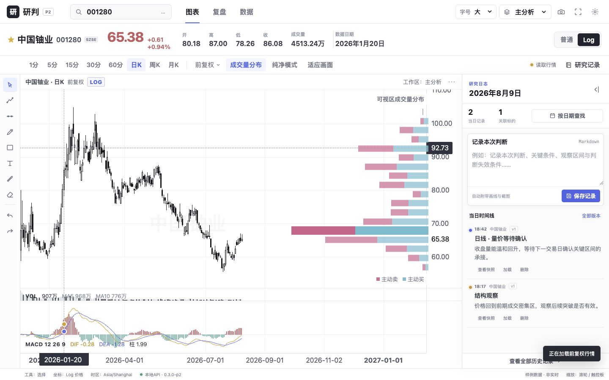

# P2 行情与周期验收报告

日期：2026-08-10  
版本：`0.3.0-p2`

## 已完成

- A股、北交所与港股代码归一化；
- 腾讯免费行情Provider适配器与可替换的后端服务边界；
- A股日/分钟K，港股日K及最新交易日分钟K；
- 1/5/15/30/60分钟、日/周/月周期；
- 前/不/后复权，A股默认前复权，按标的记忆选择；
- 原子JSON缓存、TTL、按时间键增量合并；
- 交易日筛选和日K进入5分钟分时；
- 延时、缓存、降级及数据日期状态；
- 停牌/节假日/半日数据不补空bar的聚合测试。

## 自动验证

```text
npm run build          PASS
npm run test:backend   19 passed
git diff --check       PASS
```

浏览器验收覆盖 `001280` A股日线/15分钟、`00700.HK` 港股15分钟、复权切换与1440×900视觉快照；控制台没有新增错误或警告。快速切换代码/周期时，图表按实际payload决定时间类型，避免日期与时间戳混用。

## 数据边界

免费行情不是交易级实时数据。港股分钟接口提供最近交易日会话，较早日期的分时在界面中明确降级为拟合预览；日线与复权数据不受该限制。Provider边界允许后续替换为更完整的数据源。

## 视觉基线



