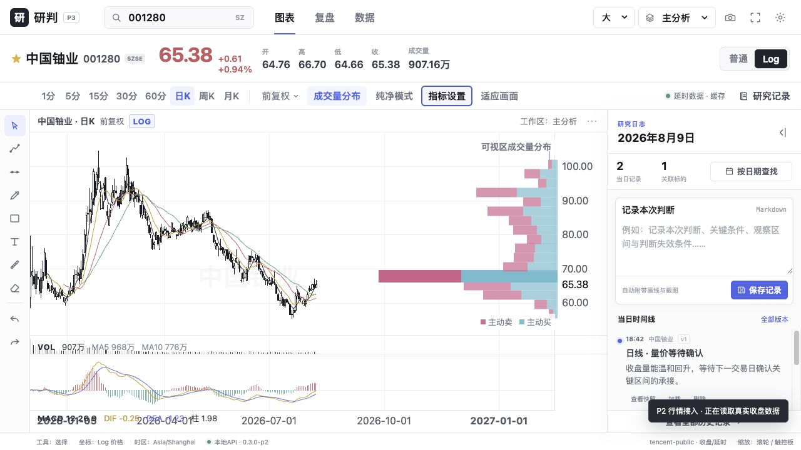

# P3 指标与多面板验收报告

日期：2026-08-10  
版本：`0.4.0-p3`

已完成MA、EMA、VOL、可编辑参数MACD、可拖动Pane、共享时间范围/十字光标、指标参数本地保存和真正的纯净模式。指标计算单元测试覆盖SMA窗口、常量序列MACD及自定义周期。

```text
npm run test:frontend   3 passed
npm run test:backend    19 passed
npm run build           PASS
浏览器控制台             0 error / 0 warning
```



