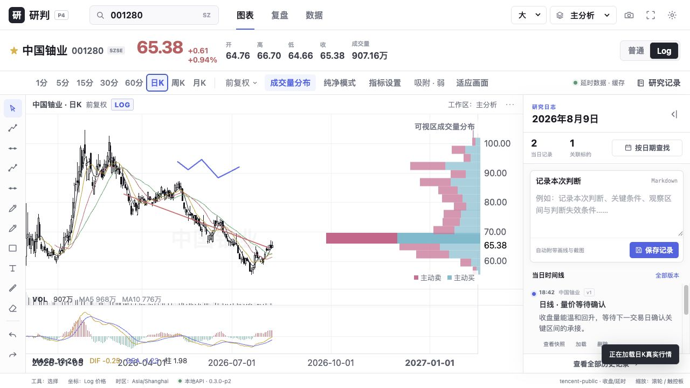

# P4 画线系统验收报告

日期：2026-08-10  
版本：`0.5.0-p4`

已完成金融坐标SVG画线层。所有锚点与笔迹保存为时间戳/真实价格，不保存屏幕像素；缩放、平移、普通/Log切换后由图表坐标转换器重新投影。

实现范围包括水平线、趋势线、射线、通道、矩形、文本、自由画笔、荧光笔、选择移动、对象橡皮擦、锁定/复制/隐藏/删除、精确日期价格编辑、OHLC三档吸附、撤销/重做、周期可见性与三个命名工作区持久化。

```text
npm run test:frontend   5 passed
npm run test:backend    19 passed
npm run build           PASS
浏览器：趋势线/自由画笔/撤销/重做/刷新恢复/工作区隔离均通过
```



