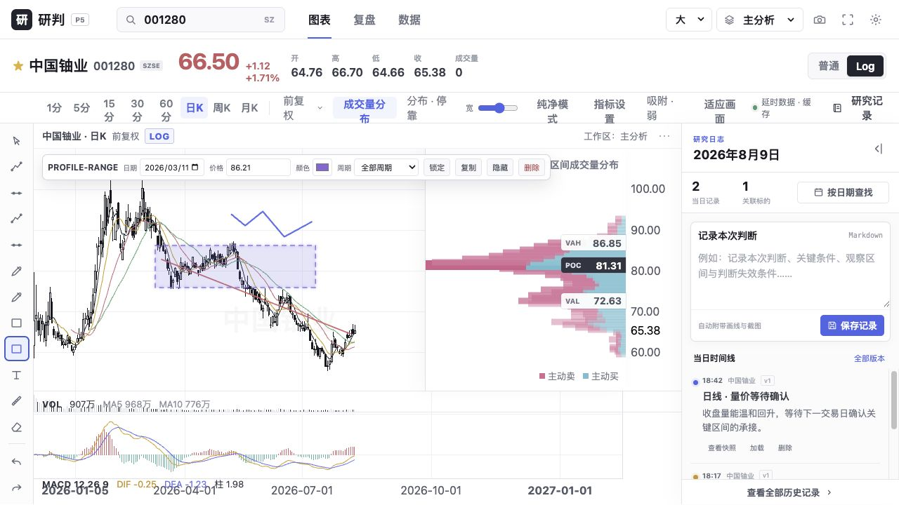

# P5 成交量分布验收报告

日期：2026-08-10  
版本：`0.6.0-p5`

实现了随可视范围防抖重算的48档Volume Profile、涨跌量近似拆分、POC/70% Value Area、VAH/VAL大标签及碰撞错位；Log轴使用对数价格分箱。锚定分布工具保存金融时间/价格区间，支持覆盖、停靠、隐藏和18%–42%宽度。

```text
npm run test:frontend   8 passed
npm run test:backend    19 passed
npm run build           PASS
浏览器：可视区/锚定区间、停靠模式、标签与控制台回归通过
```



