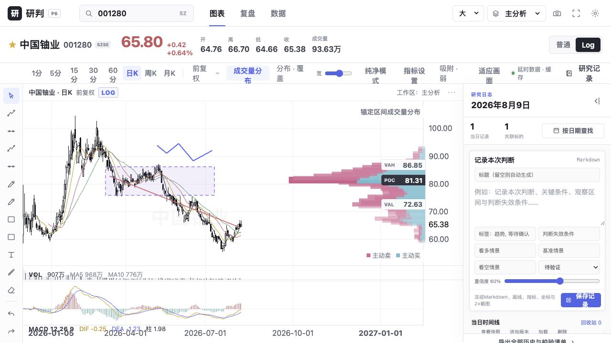

# P6 预测日志与历史追溯验收报告

日期：2026-08-10  
版本：`0.7.0-p6`

本阶段将研究日志从前端会话样例升级为SQLite事实库和追加式revision。每次保存冻结Markdown、结构化判断、金融坐标画线、指标/布局、行情截止时间与Retina PNG；快照支持只读、相邻版本对比、复制/替换工作区和当日视角。

已实现日历/时间线、同日多记录、回收站恢复、二次永久删除、单条标准Markdown目录、带SHA-256 manifest的项目ZIP、校验恢复和最近30份每日SQLite备份。

```text
npm run test:frontend   8 passed
npm run test:backend    22 passed（含revision不可覆盖、回收站、导出恢复）
npm run build           PASS
浏览器：保存v1、追加v2、PNG、版本对比、当日视角、回收站恢复、ZIP导出通过
```



