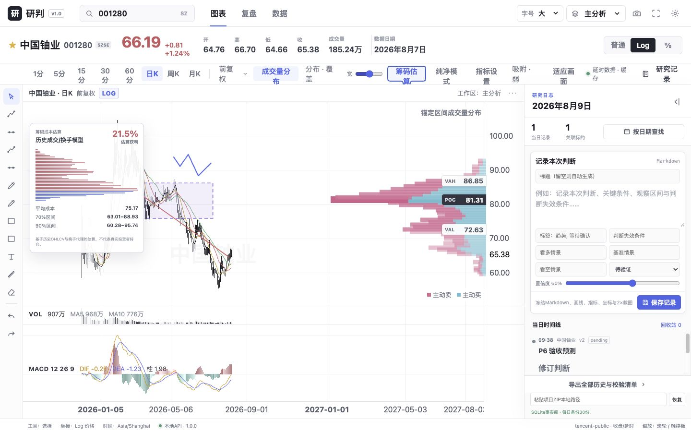
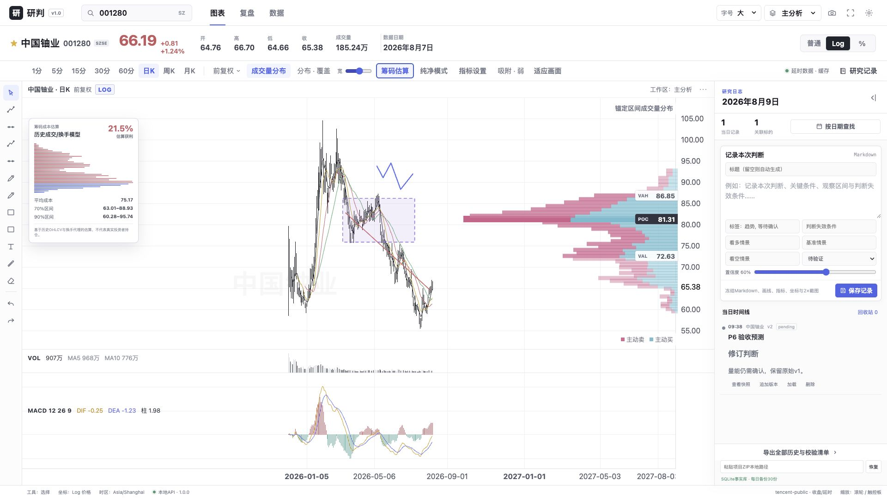

# P7 / v1.0 质量与发布报告

日期：2026-08-10  
版本：`1.0.0`

P7完成A股筹码成本估算（明确模型边界）、普通/Log/百分比坐标快捷键、两套K线配色、2×PNG导出、至少一年未来空白、代码拆包、可访问性修正、完整检查和可校验源码发布包。

```text
npm run check
  TypeScript             PASS
  frontend tests         10 passed
  backend tests          22 passed
  production build       PASS
  main JS                443.21 kB（react-markdown独立115.90 kB）
  git diff --check       PASS

浏览器回归
  1440×900 / 1920×1080  页面scroll尺寸与viewport一致
  可见无名按钮           0
  console                0 error / 0 warning
  筹码估算/%轴/PNG提示    PASS
```

## 视觉基线




